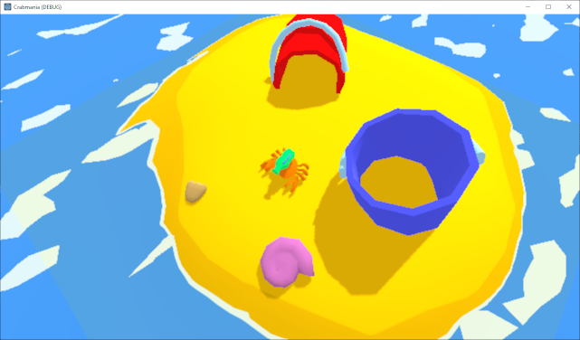

# Crabmania

Game tailored for [Weekly Game Jam - Week 162](https://itch.io/jam/weekly-game-jam-162).

Currently under development.

## Devlog Day 03 - 16.08.2020

Today's changes introduce initial weapon model and new props for arenas' designing.

* Added basic water gun model with skinning for rotation ready.
* Added bucket prop model with varying colors and rotatable handle.
* Added common shell props - clam and snail type shells.

## Devlog Day 02 - 15.08.2020

Made some fixes and adjustments.

* Fixed wet sand shader by sharpening the edges blending.

## Devlog Day 01 - 14.08.2020

I created a crab model and basic environment shaders for sea and beach sand darkening on edges. Also I implemented feature for rotating the base of the crab based on ground normal, making the crab "standing" on the ground correctly with initial movement mechanic.

