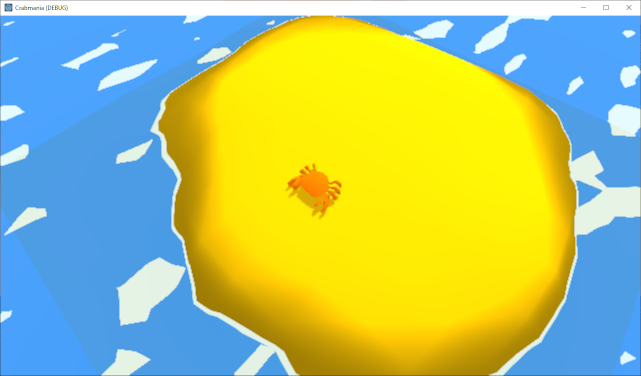

# Crabmania

Game tailored for [Weekly Game Jam - Week 162](https://itch.io/jam/weekly-game-jam-162).

Currently under development.

## Devlog Day 07 - 20.08.2020

Spent some time in Godot internal code to fix GLES2 depth texture reading shaders.

* Fixed Godot problem on reading depth texture from GLES2 shaders.

## Devlog Day 06 - 19.08.2020

Made new prop and worked on initial html5 build deployed via GitHub Pages.
Test the project on your browser: https://lethiandev.github.io/crabmania/

* Added range target prop.
* Added initial html5 build on GitHub Pages.

## Devlog Day 05 - 18.08.2020

Worked mostly on projectiles and done some fixes.

* Added water gun rotating towards cursor.
* Added basic projectile with explosion effect after collision.
* Added crab rotating to movement direction.

## Devlog Day 04 - 17.08.2020

Introduced key mapping and crab movement.

* Added key action bindings for crab movement.
* Added crab movement based on camera angle.
* Added camera folowing the player's crab.

## Devlog Day 03 - 16.08.2020

Today's changes introduce initial weapon model and new props for arenas' designing.

* Added basic water gun model with skinning for rotation ready.
* Added bucket prop model with varying colors and rotatable handle.
* Added common shell props - clam and snail type shells.

## Devlog Day 02 - 15.08.2020

Made some fixes and adjustments.

* Fixed wet sand shader by sharpening the edges blending.

## Devlog Day 01 - 14.08.2020

I created a crab model and basic environment shaders for sea and beach sand darkening on edges. Also I implemented feature for rotating the base of the crab based on ground normal, making the crab "standing" on the ground correctly with initial movement mechanic.

